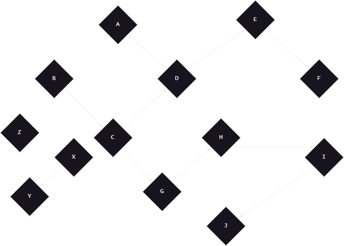

# CS 260 Final Project: Graph

## Quickstart
This file contains design notes for my final project and game.

To compile game, include:
```
g++ story.cpp graph.cpp player.cpp game.cpp WIZARDVILLE
```

Compile demo game:
```
g++ demo.cpp graph.cpp player.cpp demo
```

To compile unit tests, include: 
```
g++ tests.cpp graph.cpp tests
```


### Shortcuts

* [Design](#design)
    * [Inspiration](#inspiration)
    * [Solving a problem](#solving-a-problem)
    * [Design outline](#design-outline)
* [Tests](#tests)
    * [Unit tests](#unit-tests)
    * [Test run design](#test-run-design)

## Design

### Inspiration

The first application I saw for a graph data structure is the skeleton for a text-based adventure game. For example, Zork. 

 
Found on [archive.org](https://archive.org/details/zork-i-ii-iii-maps/)

In Zork, the player navigates the world by entering a direction (north/east/south/west) into the console. Each location behaves as a node, as it has its own unique data and connections to other locations. Connections between locations can even be one-way passages, similar to the directionality of graph nodes.

Another example and point of inspiration is [Twine 2](https://twinery.org/), a tool for building non-linear, text-based adventure games. The tool's editor interface is a graph that holds story nodes, all of which are connected by directional arcs.


### Solving a problem

As (hopefully) illustrated by my previous points, a graph is an ideal structure for modelling a non-linear story tree for a text adventure game. Each story node may hold the data for its represented "page" or location. 

In practice, this becomes more complicated, as games like Zork require a player inventory system in order for the create puzzles for the player to solve. This issue, however, is more about how each story node, or the rest of the program, works. A graph solves the problem of how to create branching story paths.

A simple version of a story node (with no concern for player inventory or conditional elements) might look like this:

```cpp
struct StoryNode {
    StoryNode *paths[5]; // Setting a limit of 5 for simplicity

    // Narrative text
    string narration;
    string title; // A unique name for the node/page/location. 
};
```

While a more complex node may look like this:

```cpp
struct StoryNode {
    StoryNode *paths[5];

    string narration;
    string title;
    
    // A special tag may tell a game-handling object how to handle this node. For example: "Start" or "End"
    string tag;
    // A possible callback that interacts with the Player object, or uses the Player object to modify itself.
    void (* callback)(StoryNode *, Player *);
    // Some games may want to count if the player has visited before, or how many times.
    int visits = 0; 
};
```

In both proposed node versions, I've modelled a connection between two nodes as one having a pointer to another--a one-directional relationship. This would thereby be a directioned graph, which I find appropriate for the purpose.

As for unlockable routes, I believe it would be appropriate to place that logic in a node's callback like so:

```cpp
void myCallback(StoryNode *node, Player *player) {
    if (player->hasItem("silver-key")) {
        // Where `OTHER_NODE_PTR` is a defined node, and `graph` is the globally defined graph. (Or, possibly, a third parameter, we will see.)
        graph->addPath(node, OTHER_NODE_PTR);
    }
}

// Connect later like so:
myNode->callback = myCallback;
```


### Design outline

Above, I've explored and outlined a couple iterations of what a `StoryNode` could look like in order to provide common adventure game mechanics. As for the program's complete structural design, I plan for something like this:


Written within the following files:

- `graph.h` & `graph.cpp`
    + `Graph` class.
    + `StoryNode` struct.
- `player.h` & `player.cpp`
    + `Player` class.
- `story.cpp`
    - Contains story contents: instances of story nodes.
- `game.cpp`
    + `main()`.
    - Input parsing and game loop.

Informal game loop test [here](..\in_class\june1.cpp), though it acts more like browsing through a linked list. I may update this demo as I go.

> Note: I've decided that `addArc()` and `addVertex()` will take pointers to actual nodes, rather than just the node's name or data. I made this decision because of the complexity of a `StoryNode`--there is more data than just a single string variable.


---
## Tests

Putting application aside and refocusing on the structure of a graph, there are a few unit tests I would like to run to prove graph functionality. 

The following examples use a Graph pointer called `graph`, and nodes of various simple names.

### Unit tests
- For `addVertex()`:

Create a new node with a value, and add to the graph:

```cpp
GraphNode *node = new StoryNode("Hello.");

graph->addVertex(node);
```

Repeat with multiple values, and check graph contents.

In advanced tests, once proven and stable, `shortestPath()` will be used to check contents. Before then, I will write a more simplistic function to print the graph's contents.

- For `addArc()`:

Using previously created nodes, create an arc/edge between them, directioned from point A to B.

```cpp
graph->addArc(nodeA, nodeB);
// OR...
nodeA->addArc(nodeB);
```

A node will have a method which returns an indexed list of its arcs. This will be used to manually test and validate the existence of an arc.

Because my design currently has a limited number of arcs, I will test cases in which the connection limit has been exceeded, and ensure the expected error is thrown.

- For `shortestPath()`:

To test `shortestPath()` (and `minSpanTree()`), I will manually code a graph like so:


Testing with this graph will test the algorithm's ability to handle variable directionality, non-connected nodes, and cycles.

I plan for `shortestPath()` to return a string describing its shortest paths to various nodes like so:

    SHORTEST PATH FROM NODE 'B'
        A - 1 STEP
        C - 1 STEP
        D - 2 STEPS [PARENT C]
        E - 3 STEPS [PARENT D]
        F - 4 STEPS [PARENT E]
        G - 2 STEPS [PARENT C]
        H - 3 STEPS [PARENT G]
        I - 4 STEPS [PARENT H]
        J - 5 STEPS [PARENT I]
        X - NO PATH
        Y - NO PATH
        Z - NO PATH

I will manually assess the output for accuracy.


- For `minSpanTree()`:

I will use the same sample graph to test `minSpanTree()`. Here is the graph's expected minimum spanning tree:


*I think there are multiple valid minimum spanning trees, so I need to decide what the flow's expected output will be.

The method's output will be expressed as a string, listing the edges included in the minimum spanning tree. Example: 

    BC, CD, DA, DE, EF, CG, GH, HI, IJ, XY

This will be manually checked (or compared against the expected string), just as `shortestPath()`.


### Test run design

Along with unit tests, I will have a complete demo in `demo.cpp`. This will test the complete game loop with a simplified story made up of three total decisions.


---
## [ complexity analysis ]


---
## [ meeting requirements ]
