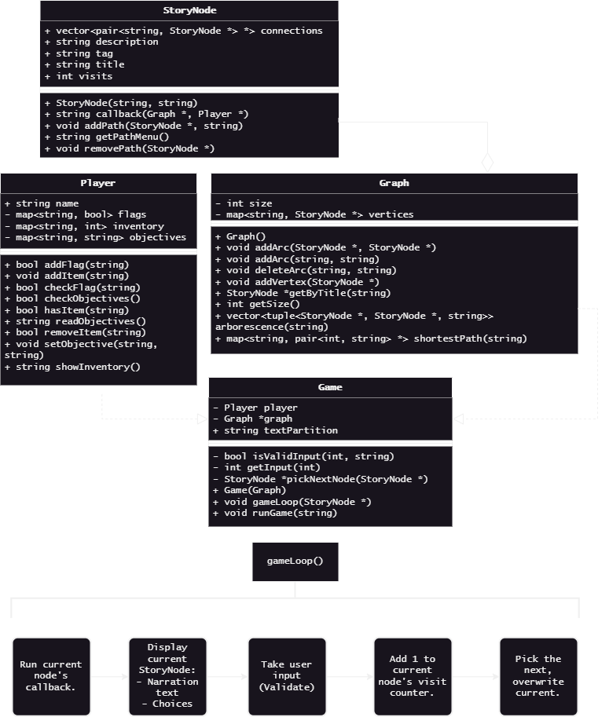

# CS 260 Final Project: Graph

## Quickstart
This file contains design notes for my final project and game.

To compile game demo (not to be confused with demo game):
```
g++ driver_game.cpp game.cpp graph.cpp player.cpp wizardville.cpp -o game
```

To compile a demo game:
```
g++ driver_demo.cpp game.cpp graph.cpp player.cpp -o demo
```

To compile graph class unit tests: 
```
g++ driver_tests.cpp graph.cpp -o tests
```

### Shortcuts

* [Design](#design)
    * [Inspiration](#inspiration)
    * [Solving a problem](#solving-a-problem)
    * [Design outline](#design-outline)
* [Tests](#tests)
    * [Unit tests](#unit-tests)
    * [Test run designs](#test-run-designs)


## Design

### Inspiration

The first application I saw for a graph data structure is the skeleton for a non-linear text-based adventure game. For example, Zork. 

 
Found on [archive.org](https://archive.org/details/zork-i-ii-iii-maps/)

In Zork, the player navigates the world by entering a direction (north/east/south/west) into the console. Each location is like a node, as it has its own unique data and connections to other locations. Connections between locations can even be one-way passages, similar to the directionality of graph nodes, or unlockable.

Another example and point of inspiration is [Twine](https://twinery.org/), a tool for building non-linear, text-based adventure games. The tool's editor interface is a graph that holds story nodes, all of which are connected by directional arcs.


### Solving a problem

As (hopefully) illustrated by my previous points, a graph is an ideal structure for modelling a non-linear story tree for a text adventure game. Each story node may hold the data for its represented "page" or location.

A simple version of a story node (with no concern for player inventory or conditional elements) might look like this:

```cpp
struct StoryNode {
    StoryNode *paths[5]; // Setting a limit of 5 for simplicity.

    // Narrative text
    string description;
    string title; // A unique name for the node/page/location. 
};
```

While a more complex node may look like this:

```cpp
struct StoryNode {
    // List of pairs of nodes and narrative text describing the option
    vector<pair<StoryNode *, string>> paths;

    string narration;
    string title;
    
    // A special tag may tell a game-handling object how to handle this node. For example: "Start", "End", or even "Checkpoint"
    string tag;
    // A possible callback that interacts with the Player object, or uses the Player object to modify itself.
    void (* callback)(StoryNode *, Graph *, Player *);
    // Some games may want to count if the player has visited before, or how many times.
    int visits = 0; 

    // ... Plus methods for construction and adding or removing an arc.
};
```

A connection between two nodes is directional--a pointer to a destination stored on the source node. This makes a directioned graph, which is appropriate for a text adventure.

Unlockable routes would be implemented in a node's callback like so:

```cpp
void myCallback(StoryNode *node, Graph *graph, Player *player) {
    if (player->hasItem("silver-key")) {
        // Where `graph->addArc()` makes a connection between two nodes, indicate by title.
        graph->addArc(node->title, "otherNode", "Open the door.");
    }
}

// Later pass into node consctructor, or connect like so:
myNode->callback = myCallback;
```

> `driver_demo.cpp` contains a driver for a brief game which only implements nodes. I used this to test and modify the structure of a node.


### Design outline

Above, I've explored and outlined a couple iterations of what a `StoryNode` could look like in order to provide common adventure game mechanics. As for the program's complete structural design, I developed this:



Written within the following files:

- `graph.h` & `graph.cpp`
    + `Graph` class.
    + `StoryNode` struct.
    + `VertexTitleConflict` exception.
    + `VertexNotFound` exception.
- `player.h` & `player.cpp`
    + `Player` class.
- `story.h` & `wizardville.cpp`
    + `getStory()` function.
    - `wizardville.cpp` contains the implementation expected by `story.h`. However any `.cpp` that implements `getStory()` could be substituted and run instead.
- `game.h` & `game.cpp`
    + `Game` class.
    + `EndProgram` error.

> I wrote an informal game loop test [here](..\in_class\june1.cpp) during the development of my design. I believe this pre-dates `driver_demo.cpp`.

> Note: I've decided that `addVertex()` will take pointers to actual nodes, rather than just the node's name or data. I made this decision because of the complexity of a `StoryNode`--there is more data than just a single string variable.


---
## Tests

Putting application aside and refocusing on the structure of a graph, there are a few unit tests I would like to run to prove graph functionality. These tests will be written in `driver_tests.cpp`.

The following examples use a Graph pointer called `graph`, and nodes of various simple names.

### Unit tests
#### For `addVertex()`:

Create a new node with a value, and add to the graph:

```cpp
// Where the first argument in node construction is the node's narrative,
// And the second is the node's unique title.
graph->addVertex(new StoryNode("data", "A"));
graph->addVertex(new StoryNode("other data", "B"));
graph->addVertex(new StoryNode("more data", "C"));
```

Checking graph contents will be done automatically, and generate a pass/fail message.


#### For `getByTitle()`:

This method is needed in order to use `addArc()` (at least the overload that takes two string inputs).

I will first attempt to get an existing node, and verify that its data is as expected. Then I will try to get a non-existant node, and verify that the expected error is raised.


#### For `addArc()`:

Using previously created nodes, create an arc/edge between them, directioned from point A to B.

```cpp
// Refers to nodes by unique title.
graph->addArc("A", "B", "");
// Note: for graph-testing purposes, I will forego giving the connection a narration.
```

A node will have a method which returns an indexed list of its arcs. This will be used to manually test and validate the existence of an arc.

#### For `shortestPath()`:

To test `shortestPath()` (and `arborescence()`), I will manually code a graph like so:


Testing with this graph will test the algorithm's ability to handle variable directionality, isolated nodes, and cycles.

I plan for `shortestPath()` to return a string describing its shortest paths to various nodes. Something like this:
```
SHORTEST PATH FROM NODE 'B'
    A - 1 STEP
    C - 1 STEP
    D - 2 STEPS [PARENT C]
    E - 3 STEPS [PARENT D]
    F - 4 STEPS [PARENT E]
    G - 2 STEPS [PARENT C]
    H - 3 STEPS [PARENT G]
    I - 4 STEPS [PARENT H]
    J - 5 STEPS [PARENT I]
    X - NO PATH
    Y - NO PATH
    Z - NO PATH
```

I will compare output to expected output for a couple different nodes.

#### For `arborescence()`:

> Note: A "minimum spanning tree" by definition, is undirected (and most often weighted). A directed equivalent would be a minimum [arborescence](https://en.wikipedia.org/wiki/Arborescence_(graph_theory)). I found [this video](https://www.youtube.com/watch?v=B5H1qlv9hrg) on deciding the minimum arborescence. In working to adapt this for a non-weighted graph, I realized I reinvented the shortest path algorithm. I will talk about this more under [Meeting Requirements](#meeting-requirements).

> I plan for my `arborescence()` (directioned MST equivalent) to return a vector of tuples, each tuple representing an edge. The first value of each tuple being the source node, the second being the destination node, and the third being the text associated with the edge. This is not how I normally store edges, however it is necessary for the arborescence.

For the arborescence, I will generate a list of all edge names from the return value of the method, and manually check them in early stages of testing. In later stages, this will be automatically evaluated against the expected strings.

The expected arborescence for my sample graph (with root node "B") includes these edges:


Along with unit tests, I will have a proof-of-concept in `driver_demo.cpp`. This will test the complete game loop with a simplified story made up of three total decisions--the player will only face two in a single playthrough. 

### Test run designs

Along with unit tests, I will have two games. 

One will be a brief demo in `driver_demo.cpp`. This will test the complete game loop with a simplified story made up of three total decisions. Additionally, this demo will only test the `StoryNode` struct on their own, without use of the `MapGraph` class. I made this decision for the sake of debugging and troubleshooting. If there's an issue, I can use this demo game to help locate it.

The second, in `driver_game.cpp` will be a (slightly) longer game with more complex paths. It will also use callbacks to change connections between nodes/vertices as the player progresses.

To visualize:


> Note: The game world map is intended to show the complexity of routes. In reality, the game ended up restricted to only the hill zone, however dynamic routes and functionality are still present.


---
## [ complexity analysis ]

In analyzing the complexity of my graph's behaviors...

---
## Meeting Requirements
